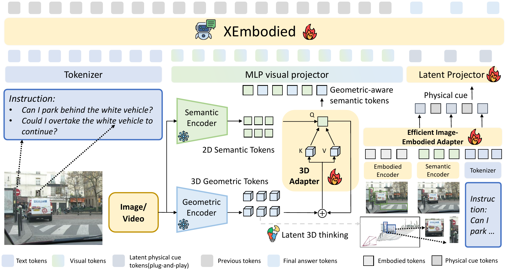
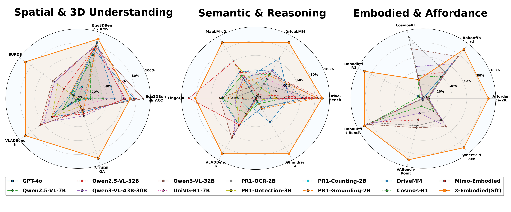

<div align="center">
<h1><b>Xiaomi-SpatialEmbodied</b></h1>
</div>

<div align="center">

[](https://arxiv.org/abs/2604.18484)

</div>

<div align="center">

**[<a href="README.md">English</a>]**
**[<a href="https://www.kaggle.com/models/zhongyangtony/xiaomi_spatialembodied/">模型权重</a>]**

</div>

<div align="center">
<strong>小米自动驾驶与机器人部团队研究工作，由小米联合高校共同完成。</strong>
</div>

**Xiaomi-SpatialEmbodied** 官方开源实现，对应论文 **XEmbodied: A Foundation Model with Enhanced Geometric and Physical Cues for Large-Scale Embodied Environments**（[arXiv 2604.18484](https://arxiv.org/abs/2604.18484)）。

该模型面向自动驾驶与机器人 VQA 数据闭环系统，在增强领域语义和三维理解能力的同时保留通用视觉语言能力。实现对应论文中的两条互补路线：注入内禀空间表征的几何适配器，以及将物理线索压缩后注入上下文的具身适配器。

**核心贡献：**
- 提出 Xiaomi-SpatialEmbodied，一个融合内禀几何表征与物理线索交互的云端具身闭环 VQA 通用模型
- 提出 3DA 与 EIEA 驱动的隐式物理线索对齐，实现自适应几何先验注入与高效物理增强推理
- 设计渐进式领域课程以实现鲁棒适应并减少遗忘，在 18 个基准上验证了一致的具身智驾理解增益

## 模型介绍

Xiaomi-SpatialEmbodied 以 Qwen3-VL-30B-A3B-Instruct 为多模态语言骨干，并增加可训练的空间与具身接口。每张图像同时经过 Qwen 视觉塔和 VGGT 三维基础模型，特征在语言推理前完成对齐，使空间证据进入模型内部表示，而不是作为文本或外部深度图拼接。

- **3D Adapter（3DA）**：VGGT 从同一相机图像提取多层几何特征；`VGGTEmbeddingMerger` 将 VGGT patch 网格重采样到 Qwen 图像 token 网格，经过 token 合并、归一化和 MLP 投影，再通过交叉注意力残差注入（图像 token 查询 VGGT token）。该设计不改变原始序列长度，同时补充深度、布局和相对位置线索。
- **Efficient Image-Embodied Adapter（EIEA）**：将占据栅格、3D 框和高精地图等具身工具输出蒸馏为紧凑的 TOR embedding，并在指定位置注入 MLLM 上下文，为模型提供物理可供性先验。本仓库提供推理侧消费者和预计算缓存。
- **渐进式领域课程**：训练从通用多模态能力开始，逐步加入空间/3D 监督，再过渡到自动驾驶和机器人数据，以减少灾难性遗忘；论文报告的 18 个基准均验证了稳定增益。

正式发布的主模型位于 `xiaomi_spatialembodied/3DA/my_qwen3_vggt_xattnv2/`；`xiaomi_spatialembodied/3DA/variants/` 中的连接器用于消融实验。

### 模型结构

<div align="center">
  
  <br>
  <em>Xiaomi-SpatialEmbodied 模型结构。</em>
</div>

### 基准结果概览

<div align="center">
  
  <br>
  <em>模型在空间与 3D 理解、语义与推理、具身与可供性基准上的综合表现。</em>
</div>

## News
- 2026/09/14: Xiaomi-SpatialEmbodied 项目代码正式开源
- 2026/04/20: Xiaomi-SpatialEmbodied 论文上线 arXiv 预印本平台

## 实验结果

### 表 1：空间与 3D 理解
表中最佳结果加**粗**。

| 模型 | Ego3DBench ACC | Ego3DBench RMSE | SURDS | VLADBench | STRIDE-QA |
|---|---|---|---|---|---|
| **闭源模型** | | | | | |
| GPT-4o [67] | 52.70 | 19.20 | 13.31 | 56.00 | 14.70 |
| Gemini-1.5 [82] | 53.50 | 19.62 | 32.77 | 54.23 | - |
| **开源模型** | | | | | |
| Qwen2.5-VL-7B [5] | 41.10 | 30.36 | 12.61 | 50.75 | 1.41 |
| Qwen2.5-VL-32B [5] | 57.30 | 15.87 | 38.82 | 61.33 | 6.58 |
| Qwen3-VL-A3B-30B [4] | 53.15 | 13.84 | 38.69 | 59.81 | 8.69 |
| Qwen3-VL-32B [4] | **59.93** | 15.70 | 41.53 | 61.64 | 6.00 |
| **空间模型** | | | | | |
| UniVG-R1-7B [6] | 46.82 | 53.85 | 1.96 | 46.51 | 4.61 |
| PR1-OCR-2B [101] | 38.88 | 11.60 | 13.81 | 44.65 | 8.18 |
| PR1-Detection-3B [101] | 36.74 | 62.61 | 33.84 | 56.08 | 4.35 |
| PR1-Counting-2B [101] | 40.32 | 51.95 | 13.69 | 48.52 | 1.94 |
| PR1-Grounding-2B [101] | 39.54 | 12.34 | 13.96 | 43.67 | 7.15 |
| **具身模型** | | | | | |
| DriveMM [36] | 49.73 | 12.68 | 8.73 | 47.45 | 1.12 |
| Cosmos-R1 [2] | 45.62 | 23.41 | 10.05 | 55.93 | 1.03 |
| Mimo-Embodied [29] | 53.62 | 16.57 | 24.04 | 55.82 | 7.90 |
| **本模型** | | | | | |
| Xiaomi-SpatialEmbodied (Best) | 55.28 | **9.25** | **83.83** | **68.61** | **27.76** |

### 表 2：语义与推理
表中最佳结果加**粗**。

| 模型 | DriveBench | DriveLMM-o1 | MapLM-v2 | LingoQA | Omnidrive |
|---|---|---|---|---|---|
| **闭源模型** | | | | | |
| GPT-4o [67] | 47.97 | 57.84 | 57.81 | 53.58 | 4.54 |
| Gemini-1.5 [82] | - | - | 58.44 | 61.30 | 2.73 |
| **开源模型** | | | | | |
| Qwen2.5-VL-7B [5] | 43.29 | 37.81 | 55.10 | 53.20 | 2.53 |
| Qwen2.5-VL-32B [5] | 53.06 | 55.04 | 57.47 | 43.70 | 0.00 |
| Qwen3-VL-A3B-30B [4] | 46.22 | 57.17 | 53.63 | 47.00 | 0.31 |
| Qwen3-VL-32B [4] | 51.70 | 55.29 | 46.77 | 54.30 | 0.00 |
| **空间模型** | | | | | |
| UniVG-R1-7B [6] | 48.75 | 51.42 | 39.13 | 39.20 | 1.20 |
| PR1-OCR-2B [101] | 50.73 | 47.68 | 44.05 | 48.50 | 4.07 |
| PR1-Detection-3B [101] | 41.35 | 44.81 | 62.47 | 56.08 | 0.10 |
| PR1-Counting-2B [101] | 39.72 | 50.94 | 47.43 | 48.52 | 2.00 |
| PR1-Grounding-2B [101] | 52.03 | 53.83 | 51.00 | 50.30 | 4.85 |
| **具身模型** | | | | | |
| DriveMM [36] | 44.50 | 65.91 | 52.18 | 37.70 | 1.10 |
| Cosmos-R1 [2] | 35.80 | 54.66 | 55.33 | 52.70 | 1.23 |
| Mimo-Embodied [29] | 52.95 | 40.31 | 65.23 | **68.60** | 4.90 |
| **本模型** | | | | | |
| Xiaomi-SpatialEmbodied (Best) | **53.18** | **77.01** | **78.55** | 65.70 | **25.43** |

### 表 3：具身与可供性
表中最佳结果加**粗**。

| 模型 | Affordance-2K | Robo-Afford | Cosmos-R1 | Embodied-R1 | RoboRefitBench | VABench-Point | Where2place |
|---|---|---|---|---|---|---|---|
| **闭源模型** | | | | | | | |
| GPT-4o [67] | 2.70 | 3.80 | 67.40 | 0.35 | 13.40 | 0.40 | 0.44 |
| Gemini-1.5 [82] | 5.19 | 4.20 | 71.10 | - | 35.50 | 0.80 | 0.89 |
| **开源模型** | | | | | | | |
| Qwen2.5-VL-7B [5] | 8.70 | 3.00 | 72.50 | 0.25 | 76.40 | 0.75 | 0.90 |
| Qwen2.5-VL-32B [5] | 9.10 | 3.25 | 72.50 | 0.00 | 77.60 | 1.45 | 1.25 |
| Qwen3-VL-A3B-30B [4] | 8.85 | 3.65 | 74.50 | 0.05 | **83.95** | 1.10 | 1.51 |
| Qwen3-VL-32B [4] | 6.90 | 4.00 | 75.50 | 0.05 | 83.15 | 1.84 | 1.50 |
| **具身模型** | | | | | | | |
| Cosmos-R1 [2] | 6.63 | 1.95 | 72.00 | 0.05 | 34.75 | 0.35 | 0.45 |
| Mimo-Embodied [29] | 8.85 | 3.25 | **81.00** | 0.00 | 78.35 | 1.85 | 1.25 |
| **本模型** | | | | | | | |
| Xiaomi-SpatialEmbodied (Best) | **78.50** | **4.35** | 76.00 | **3.80** | 87.15 | **3.50** | **2.30** |

## TODO

- [x] 发布模型代码
- [x] 发布模型权重
- [x] 发布推理代码
- [ ] 发布训练代码
- [x] 发布评测代码（`tools/eval_tools/`；Table 3 中未提供评分脚本的具身基准已在上表中标注）
- [ ] 发布数据集下载

## 微调模型

| 模型 | 基座模型 | 代码位置 | 权重 |
|------|----------|----------|------|
| Xiaomi-SpatialEmbodied（主模型） | Qwen3-VL-30B-A3B-Instruct | `xiaomi_spatialembodied/3DA/my_qwen3_vggt_xattnv2/` | [Kaggle](https://www.kaggle.com/models/zhongyangtony/xiaomi_spatialembodied/) |

`xiaomi_spatialembodied/3DA/variants/` 下的两个连接器变体为消融实验，不提供已发布权重。

## 数据集

Xiaomi-SpatialEmbodied 在多种具身与通用 VQA 数据集上训练：

| 类别 | 数据集 |
|------|--------|
| 驾驶 VQA | LingoQA, SURDS, MapLM, DriveVQA, DriveLMM-o1, Omnidrive, BDD100K |
| 通用 VQA | RefCOCO, Flickr, VQAv2, GQA|
| 机器人操作 | RoboRefit, Cosmos-R1, RoboVQA |
| 3D / 空间 | Visual Trace, VSI-590K, SPAR-7M, OpenSpaces |
| 具身可交互性 | Part Affordance |

## 项目结构

```
BaseModel-open/
├── xiaomi_spatialembodied/
│   ├── 3DA/                                 # 3D Adapter（详见 xiaomi_spatialembodied/3DA/README.md）
│   │   ├── my_qwen3_vggt_xattnv2/           # ★ 主模型：Qwen3-VL-MoE-VGGT（3DA 几何连接器）
│   │   │   ├── modeling_qwen3_vl_moe_vggt.py  # 核心几何增强模型定义
│   │   │   ├── configuration_qwen3_vl_moe.py
│   │   │   ├── modular_qwen3_vl_moe.py
│   │   │   ├── plugin/
│   │   │   │   ├── qwen3_vl_moe_vggt_register.py  # MS-Swift 自定义模型注册
│   │   │   │   └── save_qwen3_vl_moe_vggt.py      # 合并 VGGT 权重并生成融合检查点
│   │   │   ├── scripts/                     # 4 阶段 SFT + 推理脚本族
│   │   │   └── vggt/                        # VGGT 骨干网络代码
│   │   └── variants/                        # 实验性连接器变体（不随正式版本发布）
│   │       ├── my_qwen3_moe_vl_vggt_xattn_mlp/    # 可配置融合方式 + deepstack 多连接器
│   │       └── my_qwen3_moe_vl_vggt_qformer/      # Q-Former 主连接器 + deepstack MLP
│   ├── EIEA/                                # 仅推理侧；详见 xiaomi_spatialembodied/EIEA/README.md
│   │   ├── README.md                        # 开源范围、快速开始、已知限制
│   │   ├── infer_with_EIEA_3D.py            # 加载随仓库提供的 TOR 缓存并推理
│   │   ├── models/
│   │   │   ├── qwen3_vl_vggt_register.py    # 集成 TOR 物理嵌入注入的模型注册文件
│   │   │   ├── qwen3_vl_moe_vggt.py         # 支持物理-几何双增强的模型定义
│   │   │   └── ...
│   │   ├── tor_embeds_cache_fb.pt           # 预缓存物理先验 TOR 嵌入（qwen3_vl_vggt_register.py 实际加载的文件）
│   │   └── tor_embeds_cache.pt              # 另一份内容不同的 TOR 缓存（见下表说明）
│   └── infer_demo.py                        # 基础 VLM 推理入口
├── demo/                                    # 快速开始用的合成示例图（无第三方版权）
├── model_tools/                             # VGGT ↔ Qwen 网格对齐调试工具
├── requirements.txt / .gitignore
└── tools/                                   # 数据处理与评测工具集（详见 tools/README_TOOLS.md）

4 阶段训练脚本位于 `xiaomi_spatialembodied/3DA/my_qwen3_vggt_xattnv2/scripts/`（各脚本用途见 `xiaomi_spatialembodied/3DA/README.md`）。

**文档导航：**

| 文档 | 内容 |
|---|---|
| [`README_CN.md`](README_CN.md) | 总览、实验结果、环境、推理快速开始 |
| [`xiaomi_spatialembodied/3DA/README.md`](xiaomi_spatialembodied/3DA/README.md) | 3DA 目录布局、主模型 vs 变体、VGGT/Qwen 网格对齐 |
| [`xiaomi_spatialembodied/EIEA/README.md`](xiaomi_spatialembodied/EIEA/README.md) | EIEA 开源范围、快速开始、已知限制 |
| [`tools/README_TOOLS.md`](tools/README_TOOLS.md) | 数据转换 / 评测 / 可视化脚本 |
    ├── convert_data_tools/                 # 数据集格式转换脚本
    ├── parse_io_tools/                     # 原始数据集解析（Parquet/Arrow/PKL）
    ├── infer_tools/                        # 推理辅助工具与输出后处理
    │   └── infer_demo_show.py              # 可视化推理演示脚本
    ├── eval_tools/                         # 基准评测与分数聚合
    ├── vis/                                # 结果可视化
    ├── data_statistics/                    # 数据统计、过滤与采样
    ├── build_model/                        # 模型参数计数与检查点工具
    ├── reward_tools/                       # GRPO/RL 训练的奖励模型工具
    ├── trainer_tools/                      # 训练调试与启动脚本
    └── planningQA/                         # 规划问答数据准备
```

## 模型架构

Xiaomi-SpatialEmbodied 为统一的自动驾驶与具身智能基础模型框架，几何连接器（3DA）与物理线索注入范式（EIEA）深度协同，整体基于 Qwen3-VL-30B-A3B-Instruct 构建：

### 1. 3DA：几何空间增强连接器

3D Adapter (3DA) 是一种几何连接器，将三维基础模型（VGGT）的表征注入多模态大语言模型，显式对齐三维结构与语言推理，赋予模型内生的三维感知能力，使其无需依赖外部深度模型即可原生理解具身场景的三维几何结构。不同于简单附加深度或点云的辅助输入方式，3DA 把 VGGT 特征直接融合进原生视觉令牌流。

核心组件：
- **VGGTSpatialEncoder**：加载 VGGT 聚合器提取图像多层空间特征，精简冗余头结构以降低显存消耗
- **VGGTEmbeddingMerger**：完成 3D 空间令牌与原生 2D 视觉令牌的对齐融合，通过插值、令牌合并、RMSNorm + MLP 投影与 Cross-Attention 机制，将三维几何线索注入视觉语言模型

该模型通过 MS-Swift 注册，支持一站式微调与推理，是 Xiaomi-SpatialEmbodied 几何感知能力的基础载体。

#### 实现变体

`xiaomi_spatialembodied/3DA/` 下除正式发布的主模型外，另有两个实验性连接器变体，用于消融对比：

| 目录 | MS-Swift `model_type` | 主连接器 | deepstack 多连接器 |
|---|---|---|---|
| `my_qwen3_vggt_xattnv2/` ★ **主模型，已发布** | `qwen3_vl_moe_vggt` | `VGGTEmbeddingMerger`：插值 → 令牌合并 → RMSNorm+MLP → 交叉注意力残差融合（Q=图像令牌，K/V=VGGT 3D 令牌） | ✗（Qwen3 自身 deepstack 特征原样透传，VGGT 仅注入图像令牌流） |
| `variants/my_qwen3_moe_vl_vggt_xattn_mlp/` | `qwen3_vl_moe_vggt_xattn_mlp` | 同族 merger，`fusion_method` 可配：`add` / `concat` / `gated` / `weighted` / `cross_attention` | ✓ 每层一个 `VGGTEmbeddingMerger`，`deepstack_fusion_method="add"` |
| `variants/my_qwen3_moe_vl_vggt_qformer/` | `qwen3_vl_moe_vggt_qformer` | `VGGTQFormerConnector`：language-initialized Q-Former 选出 K=8 个几何令牌，concat 在原生视觉令牌之前 | ✓ 每层一个轻量 MLP `VGGTDeepstackConnector`，按元素相加融合 |

同一次 `swift` 运行只能通过 `--custom_register_path` 挂载**一个**变体。完整目录说明、各变体脚本与 VGGT 路径解析（`VGGT_REPO_DIR`）见 [`xiaomi_spatialembodied/3DA/README.md`](xiaomi_spatialembodied/3DA/README.md)。

> **关于令牌记账**：已发布的主模型**不新增任何 token**——连接器把 VGGT patch grid 重采样到 Qwen3 的图像 token 网格上，以交叉注意力残差加回原有视觉嵌入。只有未发布的 Q-Former 变体才引入"专用 3D 令牌"。

#### VGGT / Qwen 网格对齐

两路视觉流最终被重采样到同一网格，因此 VGGT 输入如何取景会影响对齐结果。已发布权重训练时使用的是：**VGGT 流 letterbox 补白到 518×518 正方形**，而 Qwen 流保持原图长宽比，连接器用 **bilinear** 重采样。对非正方形图像，两套网格只在图像中心附近一致。两个开关均可配置，默认值即已发布行为：

```python
vggt_connector_config = {
    "letterbox": True,          # 或 export VGGT_LETTERBOX=0
    "interp_mode": "bilinear",  # 或 export VGGT_INTERP_MODE=nearest-exact
}
```

改动任意一项都会使按另一设置训练出的权重失效，因此**仅在重新训练时修改**。详见 [`xiaomi_spatialembodied/3DA/README.md`](xiaomi_spatialembodied/3DA/README.md)。

### 2. EIEA：高效图像-具身适配器

已有工作利用具身专用工具（如占据网格、3D 框、高精地图线索）显式引导 VQA 推理，但此类显式工具调用存在效率低、工具输出与语言推理过程对齐差的问题。为解决这些局限，EIEA 将原始工具输出蒸馏为紧凑的令牌摘要（TOR 嵌入），并通过 `masked_scatter` 无缝回注到 MLLM 上下文中，规避了 LLM 的可解释性负担。

EIEA 与 3DA 共享模型底层结构，共同构成 Xiaomi-SpatialEmbodied 的完整具身感知能力。

> **本次开源范围**：本仓库提供一份预计算的 TOR 嵌入缓存（`xiaomi_spatialembodied/EIEA/tor_embeds_cache*.pt`）以及使用该缓存的推理代码；
> **生成该缓存的 EIEA 流程暂未开源**。

## 环境配置

### 1. 基础环境

```bash
conda create -n xiaomi_spatialembodied python=3.10
conda activate xiaomi_spatialembodied

# 安装 PyTorch
pip install torch>=2.4.0 torchvision>=0.19.0
```

### 2. MS-Swift（训练与推理框架）

```bash
pip install ms-swift
pip install qwen_vl_utils==0.0.14
pip install trl -U
pip install deepspeed
pip install transformers>=4.57.1
pip install decord
```

> ⚠️ **`transformers` 必须 ≥ 4.57**。Qwen3-VL（含 MoE）自 4.57 才引入，模型代码 import 了
> `transformers.models.qwen3_vl_moe.modeling_qwen3_vl_moe`；MS-Swift 注册文件里也声明了同样的约束
> （`requires=["transformers>=4.57", ...]`）。
>
> `deepspeed` 是 `xiaomi_spatialembodied/3DA/*/scripts/` 下所有脚本的硬依赖（均传 `--deepspeed zero2|zero3`）；
> `decord` 用于解码视频样本。
>
> vLLM 仅评测工具需要，且会自带 torch 覆盖上面的版本约束，建议单独建环境。

完整版本清单见 [`requirements.txt`](requirements.txt)。

### 3. EIEA 依赖

```bash
pip install peft==0.14.0
pip install aenum sentencepiece protobuf
```

## 快速开始：路径配置

运行推理脚本前需配置模型路径，仓库默认采用相对路径规划，仅需更新指定占位路径即可。

### 所需模型与权重说明
| 项目 | 默认位置 | 重要说明 |
|------|----------|----------|
| Qwen3-VL-30B-A3B-Instruct | `Qwen/Qwen3-VL-30B-A3B-Instruct` | 基座模型，支持自动下载 |
| VGGT-1B 权重（`model.pt`） | 磁盘任意位置，经 `--vggt_ckpt_path` 传给 `save_qwen3_vl_moe_vggt.py` | 从 [facebook/VGGT-1B](https://huggingface.co/facebook/VGGT-1B) 下载。**再分发融合权重前请先确认 VGGT 许可证。** |
| VGGT 骨干代码 | 含 `vggt/` 包的**父目录**，经 `VGGT_REPO_DIR` 指定 | 仓库自带一份：`xiaomi_spatialembodied/3DA/my_qwen3_vggt_xattnv2/vggt/`，故 `VGGT_REPO_DIR=xiaomi_spatialembodied/3DA/my_qwen3_vggt_xattnv2` 即可。内置默认值**不解析**，务必显式 export。 |
| 训练完成模型权重 | Kaggle Model Scope 下载 | 可推理的完整权重：https://www.kaggle.com/models/zhongyangtony/xiaomi_spatialembodied/ |
| VGGT 注册文件 | `xiaomi_spatialembodied/3DA/my_qwen3_vggt_xattnv2/plugin/qwen3_vl_moe_vggt_register.py` | MS-Swift 模型注册文件（主模型；变体见 `xiaomi_spatialembodied/3DA/variants/`） |
| EIEA 注册文件 | `xiaomi_spatialembodied/EIEA/models/qwen3_vl_vggt_register.py` | 集成物理嵌入注入的注册文件 |
| TOR 嵌入缓存 | `xiaomi_spatialembodied/EIEA/tor_embeds_cache_fb.pt` | 随仓库提供的预计算缓存；生成它的 EIEA 流程暂未开源 |
| 第二份 TOR 缓存 | `xiaomi_spatialembodied/EIEA/tor_embeds_cache.pt` | 内容与 `_fb.pt` **不同**。`qwen3_vl_vggt_register.py` 只加载 `_fb.pt`（`TOR_EMBEDS_PATH`，第 32 行）；要用这份需改该常量。 |

### 配置步骤
1. **下载基座 VLM**：下载 [Qwen3-VL-30B-A3B-Instruct](https://huggingface.co/Qwen/Qwen3-VL-30B-A3B-Instruct) 或由 MS-Swift 自动下载
2. **下载 VGGT-1B**，并导出代码在加载时读取的环境变量：
   ```bash
   export VGGT_REPO_DIR=/path/to/xiaomi_spatialembodied/3DA/my_qwen3_vggt_xattnv2  # vggt/ 包的父目录
   export VGGT_DEVICE=cuda:0     # 默认是 cpu，30B 模型下不可用
   export VGGT_DTYPE=bfloat16    # 默认是 float32
   ```
3. **构建含 VGGT 权重的融合检查点**（必需——模型代码本身不加载 VGGT 权重）：
   ```bash
   python xiaomi_spatialembodied/3DA/my_qwen3_vggt_xattnv2/plugin/save_qwen3_vl_moe_vggt.py \
     --base_model_dir  /path/to/Qwen3-VL-30B-A3B-Instruct \
     --vggt_ckpt_path  /path/to/VGGT-1B/model.pt \
     --vggt_repo_dir   /path/to/xiaomi_spatialembodied/3DA/my_qwen3_vggt_xattnv2 \
     --output_dir      xiaomi_spatialembodied/3DA/my_qwen3_vggt_xattnv2/base_ckpt
   ```
   也可以直接把 `xiaomi_spatialembodied/infer_demo.py` 里 `CUSTOM_MODEL_CFG["model_path"]` 指向 Kaggle 下载的权重（那份已经融合过）。
4. **EIEA 物理嵌入准备**：仓库已内置预缓存 TOR 嵌入文件，无需额外下载预训练模型，直接使用即可
5. **训练**：4 阶段配方编码在 `xiaomi_spatialembodied/3DA/my_qwen3_vggt_xattnv2/scripts/sft_ddp_s{1..4}*.sh` 中；每阶段的 `--model` 指向上一阶段的 merged checkpoint

## 推理

### 方式一：3DA 几何增强推理
使用 `xiaomi_spatialembodied/infer_demo.py`，基于 MS-Swift 调用 Xiaomi-SpatialEmbodied 几何连接器。脚本自带一张合成示例图
（`demo/sample.jpg`），无需下载任何数据集即可跑通：

```bash
# 在仓库根目录执行
export VGGT_REPO_DIR=$PWD/xiaomi_spatialembodied/3DA/my_qwen3_vggt_xattnv2   # vggt/ 包的父目录
export VGGT_DEVICE=cuda:0
export VGGT_DTYPE=bfloat16

python xiaomi_spatialembodied/infer_demo.py
```

脚本配置项：
```python
# 启用 Xiaomi-SpatialEmbodied 几何增强模型
USE_CUSTOM_MODEL = True

# 自定义模型配置（Kaggle 下载的权重，或本地融合出的 base_ckpt）
CUSTOM_MODEL_CFG = {
    "model_path": "指向**已融合 VGGT 权重**的检查点目录",
    "model_type": "qwen3_vl_moe_vggt",
    "register_file": "<repo>/xiaomi_spatialembodied/3DA/my_qwen3_vggt_xattnv2/plugin/qwen3_vl_moe_vggt_register.py",
}

# 原生模型配置
NATIVE_MODEL_CFG = {
    "model_path": "Qwen/Qwen3-VL-30B-A3B-Instruct",
    "model_type": "qwen3_vl_moe",
}

# 推理参数
INFER_CFG = {
    "max_tokens": 512,
    "temperature": 0,
    "user_prompt": "你的提示词",
    "image_paths": ["<图片路径>"]
}
```

### 方式二：EIEA 物理-几何双增强推理
使用 `xiaomi_spatialembodied/EIEA/infer_with_EIEA_3D.py` 加载随仓库提供的 TOR 缓存并运行物理线索注入推理：

```bash
cd xiaomi_spatialembodied/EIEA
python infer_with_EIEA_3D.py
```

该脚本演示如何加载随仓库提供的 TOR 嵌入缓存并完成注入，配合 VGGT 几何分支做物理-几何双线索推理。无需下载额外预训练模型。

> ⚠️ 仓库只提供**一份预计算的 TOR 嵌入缓存**与使用它的推理代码；**生成该缓存的 EIEA 流程暂未开源**。
> 因此在示例中注入的是一段**固定的软提示**，而不是针对每张输入图实时生成的物理先验。

## 工具集

详见 [tools/README_TOOLS.md](tools/README_TOOLS.md) 获取各工具的详细文档，包括功能说明和使用示例。

| 目录/脚本 | 功能 |
|-----------|------|
| `convert_data_tools/` | 将 NuScenes、OmniDrive、LingoQA、MapLM-v2、DriveBench 等具身数据集转为 MS-Swift 训练 JSONL 格式 |
| `parse_io_tools/` | 解析原始数据集（Parquet/Arrow/PKL）为结构化 JSON/JSONL 格式 |
| `infer_tools/` | 推理辅助工具、输出后处理和演示脚本 |
| `eval_tools/` | 基准评测和分数聚合（18+ 基准） |
| `vis/` | 评测结果和数据集样本可视化 |
| `data_statistics/` | 数据统计、过滤、采样和质量检查 |
| `build_model/` | 模型参数计数和检查点工具 |
| `reward_tools/` | GRPO/RL 训练的奖励模型工具 |
| `trainer_tools/` | 训练调试和启动脚本 |
| `planningQA/` | 规划问答数据准备 |

## 作者

Kangan Qian<sup>\*</sup>, ChuChu Xie<sup>\*</sup>, Yang Zhong<sup>✉,\*</sup>, Jingrui Pang, Siwen Jiao, Sicong Jiang, Zilin Huang, Yunlong Wang, Kun Jiang<sup>†</sup>, Mengmeng Yang, Hao Ye<sup>✉,†</sup>, Guanghao Zhang, Hangjun Ye, Guang Chen, Long Chen, Diange Yang<sup>†</sup>

**所属机构：** 小米公司汽车与机器人团队 &nbsp; 清华大学 &nbsp; 新加坡国立大学 &nbsp; 麦吉尔大学 &nbsp; 威斯康星大学麦迪逊分校

✉ 项目负责人 &nbsp; \* 共同一作 &nbsp; † 通讯作者

## 引用

如果本项目对您的研究有帮助，请引用：

```bibtex
@misc{qian2026xembodiedfoundationmodelenhanced,
      title={XEmbodied: A Foundation Model with Enhanced Geometric and Physical Cues for Large-Scale Embodied Environments},
      author={Kangan Qian and ChuChu Xie and Yang Zhong and Jingrui Pang and Siwen Jiao and Sicong Jiang and Zilin Huang and Yunlong Wang and Kun Jiang and Mengmeng Yang and Hao Ye and Guanghao Zhang and Hangjun Ye and Guang Chen and Long Chen and Diange Yang},
      year={2026},
      eprint={2604.18484},
      archivePrefix={arXiv},
      primaryClass={cs.CV},
      url={https://arxiv.org/abs/2604.18484},
}
```
