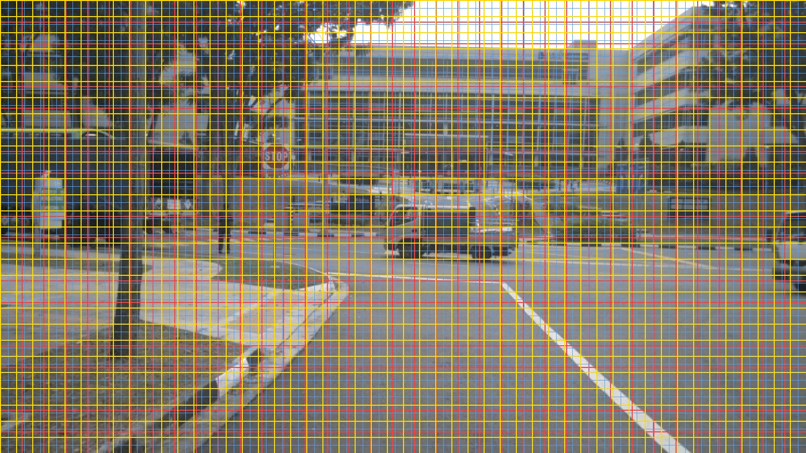
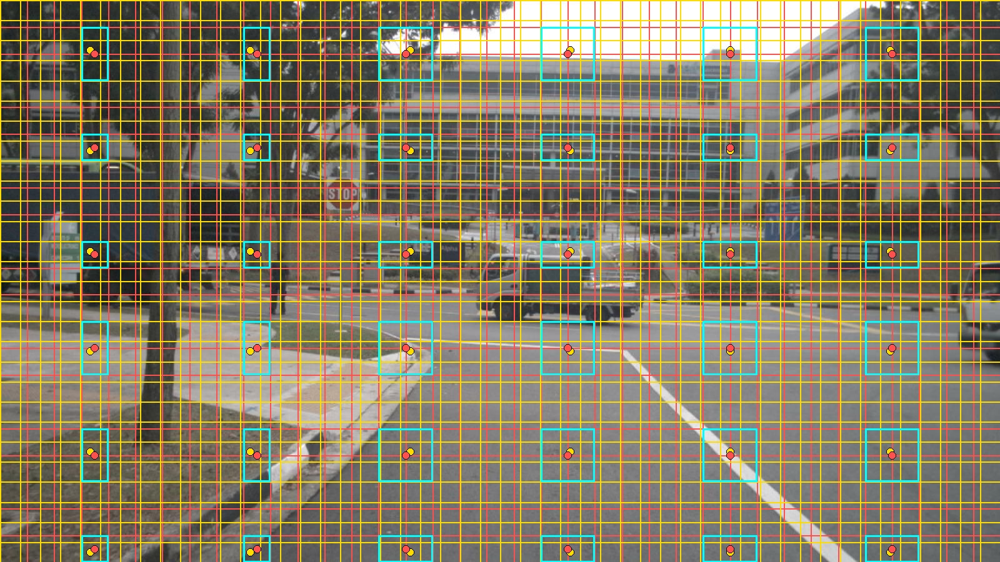

# VGGT ↔ Qwen3-VL 几何对齐可视化：方法审查、数学推导与图像解读

> 对应脚本：[`tools/debug_vggt_qwen_alignment.py`](../debug_vggt_qwen_alignment.py)  
> 输出目录：[`tools/alignment_debug/`](./)  
> 测试数据：nuScenes 1600×900 驾驶相机（FRONT / FRONT_LEFT / BACK，原图未随仓库发布）

---

> ⚠️ **重要前提：本文描述的是「修复后」的配置，与已发布的主模型并不一致。**
>
> 主模型 `xiaomi_spatialembodied/3DA/my_qwen3_vggt_xattnv2/` 的**已发布权重**是按以下配置训练的：
> `letterbox=True`（VGGT 流补白到 518×518 正方形）+ `interp_mode="bilinear"`。
> 本文（及其脚本、误差指标）分析的是**另一套**配置：不补白 + `nearest-exact`。
>
> 该「不补白 + nearest-exact」配置只在两个**未发布**的消融变体上**部分**落地：
> `variants/my_qwen3_moe_vl_vggt_xattn_mlp` 完全一致（不补白 + nearest-exact）；
> `variants/…qformer` 只对上了重采样——它用 nearest-exact，但**仍然补白**（`letterbox`）。
>
> 因此本文的结论——**post-merge 相对误差 ~0.26 token、torn 0%**——**不适用于已发布模型**。
> 已发布配置下，非正方形图像的 VGGT 与 Qwen 网格只在图像中心附近对齐：对 16:9 图像，
> 上下各约 21.6% 的 Qwen 视觉 token 融合的是白边区域派生的 3D 特征。
>
> 两个开关现在都可配置，默认即已发布行为，见 `xiaomi_spatialembodied/3DA/README.md` 的
> "VGGT / Qwen grid alignment" 一节与主 README 的同名小节。

---

## 1. 这份文档要回答什么

修复 3D 融合后，核心问题是：

> **VGGT 的 3D token 和 Qwen 的 2D visual token，在物理图像上是否指向同一块区域？**

本可视化**不跑模型前向**，只做**纯几何**分析：复现 register 预处理 + connector 的 `nearest-exact` 重采样，把两套 patch grid 画回原图，并给出可量化的误差指标。

---

## 2. 方法审查：有没有问题？

### 2.1 结论：**方法正确，且与生产代码一致**

| 步骤 | 脚本实现 | 生产代码 | 审查结果 |
|------|----------|----------|----------|
| VGGT 输入尺寸 | `vggt_preprocess_shape()` | `_preprocess_image_to_vggt_tensor(letterbox=…)` | ⚠️ 与**本文配置**（`letterbox=False`）一致：长边 518，短边 round 到 14 倍数，无 letterbox。**主模型默认 `letterbox=True`，会补白到 518×518，此处不一致** |
| VGGT patch grid | `(h_real_v//14, w_real_v//14)` | `_infer_vggt_hw()` | ✅ 一致（该函数从张量实际形状反推，两种配置下都正确） |
| Qwen patch grid | `AutoImageProcessor` → `image_grid_thw` | template 运行时同样依赖 processor | ✅ 一致（见 2.2 说明） |
| 重采样映射 | `build_nearest_exact_map()` | `_interp_one_image()` → `F.interpolate(..., mode=self.interp_mode)` | ⚠️ 与**本文配置**（`nearest-exact`）已逐元素对照验证。**主模型默认 `bilinear`，此处不一致** |
| 回投原图坐标 | 归一化中心 `(i+0.5)/grid_size` × 原图 H/W | 两路 resize 均保持宽高比 | ✅ 合理 |

**PyTorch 对照验证**（在 `vla4d` 环境）：

```python
# 对 h_v=21, w_v=37, h_q=56, w_q=100（nuScenes FRONT 实际 grid）
# 脚本 build_nearest_exact_map 与 F.interpolate(mode="nearest-exact") 输出 100% 一致
```

### 2.2 已知近似（不是 bug，需在解读时注意）

1. **Qwen processor 使用 `do_resize=True`（smart_resize）**  
   运行时 register 在尺寸已是 32 倍数时会传 `do_resize=False`；nuScenes 1600×900 不是 32 对齐，最终仍走 smart_resize。脚本注释已说明，**与真实训练路径一致**。

2. **VGGT 与 Qwen 的 resize 算法不同**  
   - VGGT：`PIL BICUBIC` → 518×294  
   - Qwen：`smart_resize` → 1600×896  
   两者都保宽高比，但 **14 像素取整 vs 32 像素取整** 会导致轻微 aspect 偏差（见 §5 数据）。

3. **只验证几何，不验证语义**  
   脚本不检查 VGGT embedding 质量、fusion 模块是否学会对齐、也不对比 bilinear vs nearest-exact 的特征向量分布。它回答的是：**“如果我把 VGGT token 按代码里的方式 resample 到 Qwen grid，空间上偏了多少？”**

4. **Q-Former 路径不适用此脚本**  
   Q-Former 用 cross-attention 从全序列选 token，不是逐 patch nearest 映射；此脚本专门验证 **fuse2d / multiconnector** 的 `_interp_one_image` 路径。

### 2.3 方法设计是否合理？

**合理，且能说明问题**，原因：

- 3D 融合的前提是 **同一物理位置** 的 2D/3D 特征才能有意义地 add/concat/gate。
- 旧方案的 letterbox padding 会在 VGGT grid 里引入 **与 Qwen 无关的白边 token**；bilinear 会在 **特征流形** 上混合相邻 token。本脚本在修复后验证：**几何上两套 grid 是否重新对齐**。
- 用 **post-merge（LLM 实际看到的 32px token）** 指标，比 pre-merge 更能反映融合效果。

---

## 3. 代码变量与数据流

### 3.1 符号表

| 符号 | 含义 | nuScenes FRONT 示例值 |
|------|------|----------------------|
| \(W_{\text{orig}}, H_{\text{orig}}\) | 原图像素尺寸 | 1600 × 900 |
| \(h_{\text{real\_v}}, w_{\text{real\_v}}\) | VGGT 输入 tensor 的 H,W | 294 × 518 |
| \(P_v = 14\) | VGGT patch size | 14 |
| \(h_v, w_v\) | VGGT token grid | 21 × 37 |
| \(P_q = 16\) | Qwen ViT patch（merge 前） | 16 |
| \(M = 2\) | Qwen spatial merge size | 2 |
| \(h_q, w_q\) | Qwen pre-merge grid | 56 × 100 |
| \(h_{\text{post}}, w_{\text{post}}\) | Qwen post-merge grid（LLM 可见） | 28 × 50 |
| \(D\) | VGGT token 特征维度 | （本脚本不涉及） |

### 3.2 VGGT 预处理（register）

对应 `_preprocess_image_to_vggt_tensor`：

```python
# 长边 = 518，短边 round 到 14 的倍数
if W_orig >= H_orig:
    w_real_v = 518
    h_real_v = round(H_orig * (518 / W_orig) / 14) * 14
else:
    h_real_v = 518
    w_real_v = round(W_orig * (518 / H_orig) / 14) * 14

h_v = h_real_v // 14
w_v = w_real_v // 14
```

对 1600×900：\(h_{\text{real\_v}} = \text{round}(900 \times 518/1600 / 14)\times 14 = 294\)，\(w_{\text{real\_v}}=518\)。

### 3.3 Qwen grid（processor）

```python
out = processor(images=[img], return_tensors="pt")
t_q, h_q, w_q = out["image_grid_thw"][0]   # 静态图 t_q = 1
h_qwen_input = h_q * 16
w_qwen_input = w_q * 16
```

对 1600×900：smart_resize 后输入 1600×896 → \(h_q=56, w_q=100\)。

### 3.4 Connector 重采样（`_interp_one_image`）

生产代码把 VGGT token 从 \((h_v, w_v)\) reshape 成 2D，再：

```python
x = vggt_frames.view(t, h_v, w_v, D).permute(0, 3, 1, 2)  # (t, D, h_v, w_v)
x = F.interpolate(x, size=(h_q, w_q), mode="nearest-exact")
```

脚本对每个 Qwen pre-merge 位置 \((i_q, j_q)\) 解析 nearest-exact 选中的 VGGT 索引 \((i_v, j_v)\)：

\[
i_v = \mathrm{clip}\!\left(\mathrm{round}\!\left(\frac{(i_q + \tfrac{1}{2})\, h_v}{h_q} - \tfrac{1}{2}\right),\ 0,\ h_v-1\right)
\]

\[
j_v = \mathrm{clip}\!\left(\mathrm{round}\!\left(\frac{(j_q + \tfrac{1}{2})\, w_v}{w_q} - \tfrac{1}{2}\right),\ 0,\ w_v-1\right)
\]

这与 PyTorch `nearest-exact`（无 align_corners）完全一致。

### 3.5 回投到原图像素坐标

两套 grid 都视为**覆盖整张原图**的均匀划分（resize 保 aspect，无 padding）：

\[
y_{\text{q\_norm}} = \frac{i_q + 0.5}{h_q}, \quad
x_{\text{q\_norm}} = \frac{j_q + 0.5}{w_q}
\]

\[
y_{\text{v\_norm}} = \frac{i_v + 0.5}{h_v}, \quad
x_{\text{v\_norm}} = \frac{j_v + 0.5}{w_v}
\]

原图像素空间中的 token 中心：

\[
C_q = (x_{\text{q\_norm}} \cdot W_{\text{orig}},\ y_{\text{q\_norm}} \cdot H_{\text{orig}}), \quad
C_v = (x_{\text{v\_norm}} \cdot W_{\text{orig}},\ y_{\text{v\_norm}} \cdot H_{\text{orig}})
\]

**Pre-merge 对齐误差**（每个 Qwen 16px patch）：

\[
e_{\text{pre}}(i_q, j_q) = \| C_q - C_v \|_2
\]

### 3.6 Post-merge 指标（LLM 真正关心的尺度）

Qwen 在 spatial merge 后，每个 LLM visual token 对应 pre-merge 的 **2×2** 块：

\[
\mathcal{S}(i_{\text{post}}, j_{\text{post}}) = \{(2i_{\text{post}}+di,\ 2j_{\text{post}}+dj) \mid di,dj \in \{0,1\}\}
\]

该块内 4 个 pre-merge cell 各映射到一个 VGGT token，取 VGGT 中心均值：

\[
\bar{C}_v = \mathrm{mean}_{(i_q,j_q) \in \mathcal{S}} C_v(i_q, j_q)
\]

**Post-merge 误差**：

\[
e_{\text{post}} = \| C_q^{\text{post}} - \bar{C}_v \|_2
\]

其中 \(C_q^{\text{post}}\) 是 post-merge cell 中心（grid 尺寸 \(h_{\text{post}}=h_q/2,\ w_{\text{post}}=w_q/2\)）。

**邻接撕裂指标 `adj_max`**：对 4 个采样到的 VGGT 索引，行/列跨度：

\[
\text{adj\_max} = \max\!\left(\max i_v - \min i_v,\ \max j_v - \min j_v\right)
\]

| adj_max | 含义 |
|---------|------|
| 0 | 4 个 pre-merge cell 指向**同一个** VGGT token |
| 1 | 指向**相邻** VGGT token（正常，grid 密度不同） |
| ≥ 2 | **撕裂**：一个 LLM token 覆盖的 3D 信息来自相距较远的 VGGT 区域（危险） |

---

## 4. 可视化图怎么读

输出两类图（每张测试图各一对）：

| 文件 | 内容 |
|------|------|
| `alignment_*_dense.jpg` | 全 grid 叠加，看整体密度与偏移 |
| `alignment_*_sparse.jpg` | 抽样箭头，看单个 LLM token 的对齐质量 |

### 4.1 Dense 图图例



| 颜色 | 含义 | 对应 grid |
|------|------|-----------|
| **红色粗线** | VGGT patch 边界 | \(h_v \times w_v = 21 \times 37\) |
| **浅蓝色细线** | Qwen pre-merge patch 边界 | \(h_q \times w_q = 56 \times 100\) |
| **黄色粗线** | Qwen post-merge 边界（每 2 条蓝线） | \(28 \times 50\) |

**如何读：**

- 红蓝线 **几乎平行、间距均匀** → 两套 grid 在同一图像坐标系下仅有微小 pitch 差（aspect 取整导致）。
- 若出现 **某侧 grid 整体偏移到图像外、或一侧明显更宽** → letterbox / 错误 padding 的典型症状（修复前会出现）。
- 红蓝 **beat 条纹**（moiré）→ 两套 grid 密度接近但不完全相等（\(100/37 \approx 2.7\)，\(56/21 \approx 2.67\)），属预期现象。

### 4.2 Sparse 图图例



| 元素 | 含义 |
|------|------|
| **红色 grid** | VGGT patch |
| **黄色 grid** | Qwen post-merge（LLM token） |
| **黄色圆点** | 某个 post-merge cell 的几何中心 \(C_q^{\text{post}}\) |
| **红色圆点** | 该 cell 内 4 个 pre-merge 采样对应的 VGGT 中心均值 \(\bar{C}_v\) |
| **青色矩形** | 这 4 个 VGGT token 在图像上的包围盒 |
| **绿色箭头** | \(C_q^{\text{post}} \rightarrow \bar{C}_v\) |

**如何读：**

- **箭头短、黄点与红点接近** → 该 LLM token 对应的 3D 特征在空间上与 2D token 一致。
- **青色框通常为 1×1 或 2×1 个 VGGT cell** → adj_max ≤ 1，无撕裂。
- **箭头很长或青色框跨越大块图像** → adj_max ≥ 2，融合会把 unrelated 3D 区域塞进同一 LLM token（修复前 letterbox + bilinear 时更常见）。

---

## 5. 实测结果（nuScenes 1600×900）

三张相机图分辨率相同，统计量完全一致（见 [`alignment_summary.json`](./alignment_summary.json)）。

### 5.1 Grid 尺寸与宽高比

| 量 | 值 | 说明 |
|----|-----|------|
| 原图 | 1600×900 | aspect = **1.778** (16:9) |
| VGGT 输入 | 518×294 (W×H) | aspect = **1.762** |
| VGGT grid | 37×21 | \(518/14 \times 294/14\) |
| Qwen 输入 | 1600×896 | aspect = **1.786** |
| Qwen pre-merge | 100×56 | 16px patch |
| Qwen post-merge | 50×28 | **LLM 实际 token grid** |

VGGT 与 Qwen aspect 相差约 **1.3%**（1.778 vs 1.762/1.786），来自不同的 patch 对齐取整；这是误差下界，无法通过插值模式完全消除。

### 5.2 数值指标

| 指标 | 值 | 相对 patch 尺寸 | 解读 |
|------|-----|-----------------|------|
| Pre-merge mean / p99 / max | 16.43 / 27.81 / 28.46 px | 1.02 / 1.73（vs 16px） | Qwen grid 比 VGGT **更细**（100 vs 37），many-to-one 映射；单 cell 中心最多偏 ~半个 VGGT cell，**预期内** |
| Post-merge mean / p99 / max | 8.34 / 14.44 / 14.44 px | **0.26 / 0.45**（vs 32px） | LLM token 尺度上平均偏差 **不到 1/4 个 token 宽度** |
| adj_max mean / max | 0.68 / 1 | — | 多数 post-merge cell 采样 1 个 VGGT cell，部分跨 **相邻** 2 个 |
| torn% (adj_max ≥ 2) | **0.0%** | — | **无撕裂** |

**相对误差公式**（脚本中的 `rel_post_mean`）：

\[
\text{rel\_post\_mean} = \frac{e_{\text{post, mean}}}{P_q \times M \times \frac{H_{\text{orig}}/h_q + W_{\text{orig}}/w_q}{2}}
= \frac{8.33}{32.07} \approx 0.26
\]

即：**平均空间偏差约为 LLM visual token 边长的 26%**。

### 5.3 从图像到结论的推理链

以 **FRONT sparse** 为例：

1. **看黄色 grid（50×28）**  
   每个黄格是 LLM 最终接收到的一个 visual token 对应的图像区域（约 32×32 原像素）。

2. **看采样点（黄点 → 红点）**  
   对每个抽样的 post-merge cell，黄点是 Qwen 侧中心，红点是 4 个 pre-merge 点 nearest 到 VGGT 后的平均中心。  
   图中 **绿色箭头普遍很短**，与 \(e_{\text{post, mean}} = 8.3\) px 一致。

3. **看青色框（4 个 VGGT token 的 bbox）**  
   绝大多数框 **只覆盖 1 个或 2 个相邻红色 VGGT cell** → adj_max ≤ 1 → torn = 0%。  
   说明：一个 LLM token 融合到的 3D 信息来自 **空间连续的** VGGT 区域，而不是被 letterbox 白边或错误插值撕到远处。

4. **看 dense 图的全局 grid**  
   红（VGGT）与黄（post-merge）**整体共线、无整体平移** → 修复 letterbox 后，VGGT 不再对 Qwen 看不到的白边区域编码 3D token。

5. **三张相机结论相同**  
   FRONT / FRONT_LEFT / BACK 统计一致，说明对齐质量由 **分辨率与预处理** 决定，与相机视角内容无关——符合纯几何分析的期望。

---

## 6. 与「旧方案」的对比（为什么现在能说明问题）

| 问题 | 旧行为 | 可视化上的表现 | 修复后 |
|------|--------|----------------|--------|
| Letterbox 518×518 | 白边进入 VGGT grid | 红 grid 有效区域只占中间条带，与 Qwen 全图 grid 不匹配 | 红 grid 覆盖全图有效内容 |
| Bilinear 插值 | 混合相邻 VGGT token 向量 | **本脚本不直接画**；几何上 nearest 已足够说明 resample 目标 | nearest-exact，每输出对应单一 VGGT token |
| 静态图 temporal repeat | VGGT 算两遍再 mean | 不影响 grid 几何 | 1 frame，计算减半 |

**本脚本证明的是几何前提已恢复**；是否带来下游任务提升，还需训练/推理实验。但几何不对齐时，fusion 模块再强也难以学到稳定 3D 先验。

---

## 7. 局限与后续可扩展

1. **未覆盖 Q-Former**：需单独分析 attention 是否聚焦到空间对应 patch。  
2. **未做 bilinear 对照图**：可加一条分支用相同 grid 画 bilinear 的“虚拟中心”，对比 nearest 与 bilinear 的空间偏移（两者几何中心相同，但 bilinear 特征不是单 token）。  
3. **仅 1600×900**：建议对 1920×1080、竖图、极端 aspect 补测。  
4. **未验证 video 多帧**：video 路径 `_make_video_tchw` 的 grid_t 与 Qwen temporal grid 对齐需另写脚本。

---

## 8. 如何复现

```bash
python \
  /path/to/xiaomi_spatialembodied/ms-swift-main/examples/custom/tools/debug_vggt_qwen_alignment.py
```

输出：

```
tools/alignment_debug/
├── alignment_FRONT_1600x900_dense.jpg
├── alignment_FRONT_1600x900_sparse.jpg
├── alignment_FRONT_LEFT_1600x900_dense.jpg
├── alignment_FRONT_LEFT_1600x900_sparse.jpg
├── alignment_BACK_1600x900_dense.jpg
├── alignment_BACK_1600x900_sparse.jpg
└── alignment_summary.json
```

---

## 9. 总结

| 问题 | 答案 |
|------|------|
| 可视化方法有没有问题？ | **没有本质问题**；与 register + `_interp_one_image` 一致，nearest-exact 公式已通过 PyTorch 验证。 |
| 为什么这样做？ | 3D/2D 融合需要 **同一物理位置** 的特征；纯几何可视化把抽象 grid 映射变成可看的线与可算的 px 误差。 |
| 真的能说明东西吗？ | **能**说明：修复后 post-merge 相对误差 **~0.26 token**、**torn 0%**；dense/sparse 图与数值互证。 |
| 不能说明什么？ | 不保证 fusion 学得好、不覆盖 Q-Former、不替代 ablation 实验。 |

**一句话结论**：在 nuScenes 16:9 驾驶数据上，**若采用「去掉 letterbox + nearest-exact」配置**（即 `letterbox=False`、`interp_mode="nearest-exact"`），VGGT 37×21 grid 与 Qwen 50×28 LLM token grid 在原图坐标系下 **整体对齐良好**；每个 LLM token 所融合的 3D 信息来自 **局部连续** 的 VGGT 区域，几何前提满足 3D fusion 的基本要求。

> ⚠️ 该结论**不适用于已发布的主模型**：主模型默认 `letterbox=True` + `bilinear`，其 VGGT grid 为 37×37（含白边），与 Qwen 50×28 网格只在图像中心附近对齐。详见文首说明。
